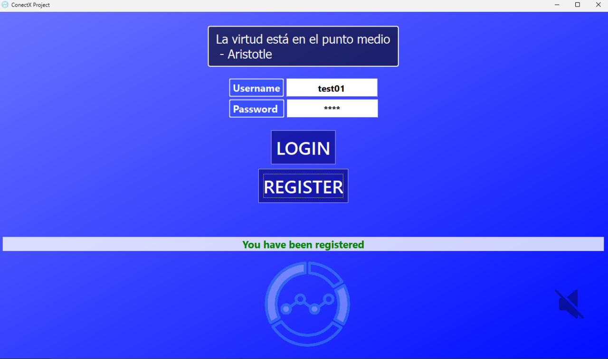
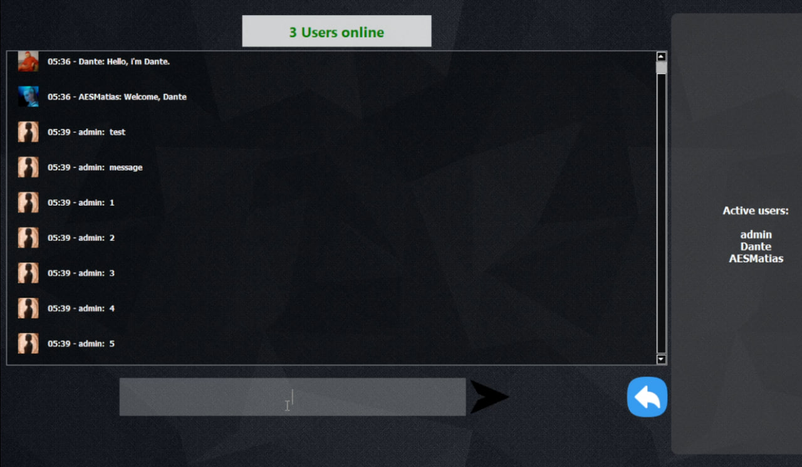

# ConnectX Project 🚀
ConnectX it's an chat application, the project it's made in PyQt6 framework and works in conjuntion with FastAPI and MySQL as DBMS.

Therefore, in order to run it, you need use this repository as backend:
https://github.com/AESMatias/ConnectX-Backend
The steps to run the backend server are basically the same: just create your .env file according to the *env.sample* file inside the repository, and run the main.py file. Do you need an MySQL instance running first. 

<iframe width="560" height="315" src="https://www.youtube.com/watch?v=Nll7__gmBSY" frameborder="0" allowfullscreen></iframe>

> **Warning:** This project is just a proof of concept that lacks of the minimum requirements and security implementations of any real application. Therefore, this code should not be used, under any circumstance, in any real environment.

> 
>

*The code is open source and free to use under the license attached in this repository* 
## Authors✨
@AESMatias & @emonkey0

### Tags:
- FastAPI 🚄
- Uvicorn 🐍
- PyQt6 🐉
- Qt
- Python 🐉
- sqlalchemy 🗃️
- Chat Application
- Sockets

## How to Get Started 🌟
1. Clone this repository to your local machine.
2. Install the required dependencies using `pip install -r requirements.txt`. 📦
3. Run the `main.py` script inside the main folder. 🏃
4. Enjoy 🌐

## Features ✨
- Real-time socket implementation.

# Next things to do and fix 🚀
- Fix the quality issue that occurs when we upload an image.
- Fix the looping of the music.
### Improve the memory optimization:

### Modularize the code and solve the problem of hight cohesion and low coupling:

### Design:
- We need to add the option that allows maximise or just shrink the windows dimensions.

### Security: message inputs, endpoints, etc...
- We need to ensure that the two sockets (to send and recibe messages) for each user connected were absolute closed through de server (maybe using a periodic func), because if this isn't done, we're having a big vulnerability breach that allows the users collapse the RAM used by the server, blowing up the entire server.

### Chat:
- When someone send a message than contains ":" and more, the app does not work anymore
because of the split method, it's very easy to fix though.
- When a new message income, we need to refresh the two instances> the pixmap and the animated label with the new picture that has been changed from our own account session.
- If the user scrolls up, then we need to calculate the current height
dinamically obtained through a function, thus allowing them to scrolls up the
chat history, because currently there's a func that scrolls the whole chat down
every 15 seconds.

# Attributions and Acknowledgments:
Settings icon: <a href="https://www.flaticon.com/free-icons/settings" title="settings icons">Settings icons created by Freepik - Flaticon</a>

Volume icon: <a href="https://www.flaticon.com/free-icons/speaker" title="speaker icons">Speaker icons created by Pixel perfect - Flaticon</a>

Volume icon muted: <a href="https://www.flaticon.com/free-icons/mute" title="mute icons">Mute icons created by Pixel perfect - Flaticon</a>

Send message icon: <a href="https://www.flaticon.com/free-icons/send" title="send icons">Send icons created by kmg design - Flaticon</a>

Undo (back) icon: <a href="https://www.flaticon.com/free-icons/back-button" title="back button icons">Back button icons created by icon_small - Flaticon</a>

Reply icon: <a href="https://www.flaticon.com/free-icons/reply" title="reply icons">Reply icons created by Andrean Prabowo - Flaticon</a>

Delete icon: <a href="https://www.flaticon.com/free-icons/recycle-bin" title="recycle bin icons">Recycle bin icons created by Uniconlabs - Flaticon</a>

Close Window icon: <a href="https://www.flaticon.com/free-icons/close" title="close icons">Close icons created by Vectors Market - Flaticon</a>

Keys Icon: <a href="https://www.flaticon.com/free-icons/smart-key" title="smart key icons">Smart key icons created by Infinite Dendrogram - Flaticon</a> https://www.flaticon.com/free-icon/key_11131969

Wallpaper at Edit Profile Frame: Photo by <a href="https://unsplash.com/@the_real_napster?utm_content=creditCopyText&utm_medium=referral&utm_source=unsplash">Dominik Lange</a> on <a href="https://unsplash.com/photos/blue-parrot-standing-on-brown-tree-branch-Lej_oqHljbk?utm_content=creditCopyText&utm_medium=referral&utm_source=unsplash">Unsplash</a>

Wallpaper at The initial Frame: Photo by <a href="https://unsplash.com/@choys_?utm_content=creditCopyText&utm_medium=referral&utm_source=unsplash">Conny Schneider</a> on <a href="https://unsplash.com/photos/a-blue-abstract-background-with-lines-and-dots-pREq0ns_p_E?utm_content=creditCopyText&utm_medium=referral&utm_source=unsplash">Unsplash</a>
  